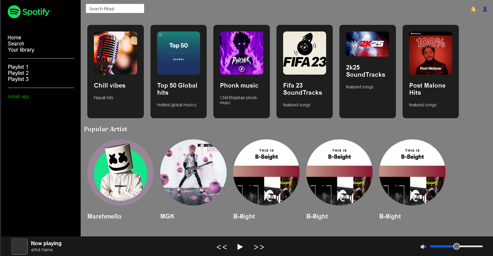

# 🎵 Spotify UI Clone

A frontend-only copy of Spotify's user interface created with HTML and CSS. This project is one of my practice efforts to enhance web design and layout with only frontend tools.

## 📸 Preview



## ✨ Features

- Sidebar navigation like Spotify (Home, Search, Library, Playlists)
- Music recommendation cards (e.g., Top 50, Chill vibes, FIFA soundtracks)
- Artist display section with circular thumbnails
- Basic responsive layout
- Sticky footer player controls

## 🧰 Tech Stack

- HTML5
- CSS3 (Flexbox, Grid)

## 🚧 Status

✅ Web view UI is completed except for minor adjustments  
⚠️ Functional interactivity and mobile responsiveness not yet implemented (coming soon)

## 📦 How to Use

1. Clone the repo:
   ```bash
   git clone https://github.com/hellykhadka7/spotify-ui-clone.git
